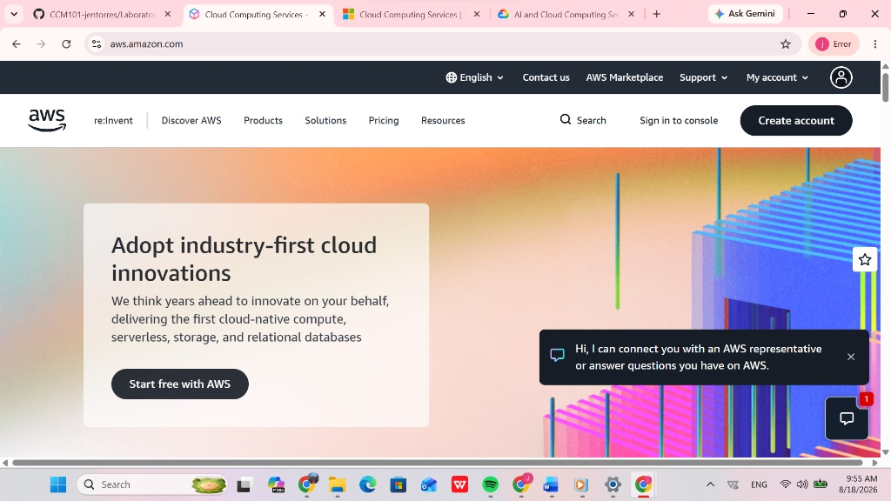

# AWS Research Report: Amazon Web Services

## Brief Overview
Amazon Web Services (AWS) is a comprehensive and broadly adopted cloud platform offered by Amazon. Launched officially in 2006, AWS provides over 200 fully featured services from data centers globally. It leads the cloud infrastructure market by offering highly scalable, reliable, and cost-effective infrastructure services powering millions of customers—including fast-growing startups, largest enterprises, and leading government agencies.

## Global Infrastructure
AWS global infrastructure is built around **Regions** and **Availability Zones (AZs)**:
* **AWS Regions:** Geographic locations around the world where AWS clusters data centers.
* **Availability Zones (AZs):** One or more discrete data centers with redundant power, networking, and connectivity within an AWS Region.
* **Edge Locations:** Points of Presence (PoP) used by Amazon CloudFront to deliver content to end-users with low latency.

## Cloud Management Console
The AWS Management Console is a web-based graphical interface that allows users to manage and access their AWS resources. It provides a centralized dashboard to search for services, monitor costs, configure permissions, and manage active compute and storage workloads.

## Four (4) Core Services

### 1. Compute: Amazon EC2 (Elastic Compute Cloud)
Provides scalable virtual servers in the cloud, allowing users to configure CPU, memory, storage, and networking capacity based on workload requirements.

### 2. Storage: Amazon S3 (Simple Storage Service)
An object storage service offering industry-leading scalability, data availability, security, and performance for storing documents, backups, and media files.

### 3. Database: Amazon RDS (Relational Database Service)
A managed relational database service that simplifies setting up, operating, and scaling databases like MySQL, PostgreSQL, MariaDB, Oracle, and SQL Server.

### 4. Networking: Amazon VPC (Virtual Private Cloud)
Allows users to provision a logically isolated section of the AWS Cloud where they can launch AWS resources in a virtual network that they define.

## Three (3) Advantages

1. **Market Maturity and Broad Feature Set:** Offers the most extensive array of features and services compared to any other cloud provider.
2. **Global Reach and Reliability:** Highly resilient global footprint ensuring high availability and fault tolerance for global applications.
3. **Vast Ecosystem and Community Support:** Massive library of documentation, community tutorials, third-party integrations, and professional certifications.

## Typical Enterprise Use Cases
* **Enterprise Application Hosting:** Hosting large-scale web applications with auto-scaling and global load balancing.
* **Data Warehousing & Big Analytics:** Running complex analytics and big data processing using services like Amazon Redshift and EMR.
* **Disaster Recovery and Backup:** Offsite data backup and high-availability disaster recovery environments.
