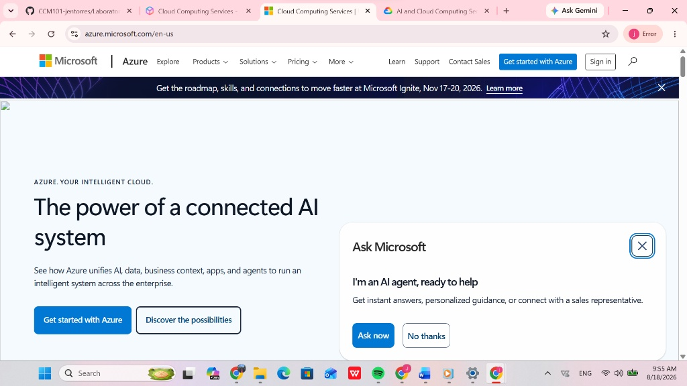

# Azure Research Report: Microsoft Azure

## Brief Overview
Microsoft Azure is a leading public cloud computing platform created by Microsoft. Officially launched in 2010, Azure provides a wide variety of cloud services including compute, analytics, storage, and networking. It is particularly renowned for its seamless integration with enterprise Microsoft technologies, hybrid cloud capabilities, and strong support for enterprise compliance standards.

## Global Infrastructure
Microsoft Azure has a vast global footprint structured around:
* **Azure Regions:** Geographic areas containing at least one, but potentially multiple datacenters linked through a dedicated latency-defined network.
* **Availability Zones:** Physically separate locations within an Azure region, equipped with independent power, cooling, and networking.
* **Geographies:** Discrete markets (such as US, Europe, Asia Pacific) that preserve data residency and compliance boundaries.

## Cloud Management Console
The Azure Portal is a web-based, unified console that provides a centralized GUI to build, manage, and monitor everything from simple web apps to complex cloud applications. It features customizable dashboards, built-in cloud shell, and global resource management tools.

## Four (4) Core Services

### 1. Compute: Azure Virtual Machines (VMs)
On-demand, scalable virtualized compute resources that support Windows Server, Linux, SQL Server, and custom application stacks.

### 2. Storage: Azure Blob Storage
Massively scalable object storage solution for unstructured data, ideal for serving images, storing files for distributed access, streaming media, and backing up data.

### 3. Database: Azure SQL Database
A fully managed relational database engine based on the latest stable version of Microsoft SQL Server, offering high availability, automated patching, and intelligence-driven optimization.

### 4. Networking: Azure Virtual Network (VNet)
The fundamental building block for private networks in Azure, enabling resources like Azure VMs to securely communicate with each other, the internet, and on-premises networks.

## Three (3) Advantages

1. **Native Microsoft Ecosystem Integration:** Provides seamless single sign-on (SSO) and native interoperability with Windows Server, Active Directory (Entra ID), and Microsoft 365.
2. **Leading Hybrid Cloud Solutions:** Best-in-class support for enterprise hybrid environments through tools like Azure Arc and Azure Stack.
3. **Cost Savings for Existing Microsoft Customers:** Offers significant cost benefits via Azure Hybrid Benefit for organizations with existing Windows Server and SQL Server licenses.

## Typical Enterprise Use Cases
* **Enterprise Hybrid Cloud:** Migrating on-premises active directories and Windows infrastructure to a hybrid cloud setup.
* **Enterprise Application Modernization:** Hosting enterprise .NET, Java, and Microsoft SQL database applications.
* **Disaster Recovery and Business Continuity:** Using Azure Site Recovery to safeguard enterprise data and ensure business continuity.
