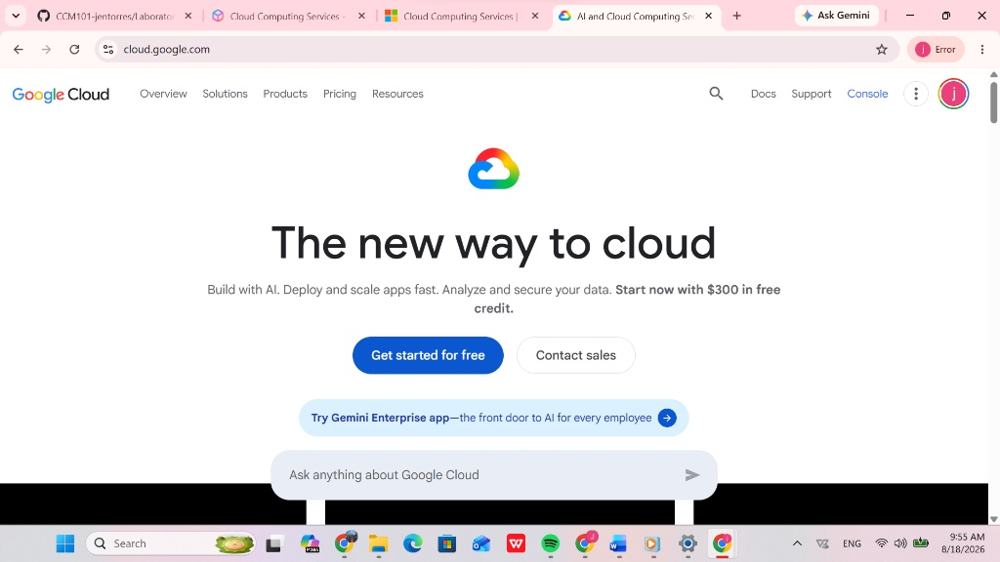

# GCP Research Report: Google Cloud Platform

## Brief Overview
Google Cloud Platform (GCP) is a suite of cloud computing services offered by Google. Officially launched in 2008, GCP runs on the same global infrastructure that Google uses internally for its end-user products like Google Search, YouTube, and Gmail. GCP is widely recognized as an industry leader in data analytics, machine learning, artificial intelligence, and open-source container orchestration via Kubernetes.

## Global Infrastructure
Google Cloud infrastructure is engineered around:
* **GCP Regions:** Independent geographic areas containing multiple data centers.
* **Availability Zones:** Isolated, high-availability deployment sites within a GCP region.
* **Global Network:** One of the largest private fiber-optic networks in the world, connecting Google's edge locations and regions to reduce network latency.

## Cloud Management Console
The Google Cloud Console is an intuitive web interface used to manage GCP resources, track billing, view operational logs, and deploy cloud applications. It features integrated Cloud Shell and comprehensive monitoring tools through Google Cloud Observability.

## Four (4) Core Services

### 1. Compute: Compute Engine
Provides customizable virtual machines running on Google's infrastructure with flexible vCPU and RAM configurations, fast boot times, and integrated security.

### 2. Storage: Cloud Storage
A unified, highly durable object storage service designed to store and retrieve any amount of data at any time with global low latency.

### 3. Database: Cloud SQL
A fully managed database service for relational databases such as MySQL, PostgreSQL, and SQL Server, handling automated backups, replication, and software patching.

### 4. Networking: Cloud VPC (Virtual Private Cloud)
Provides global, scalable private networking for GCP resources with subnets spanning across multiple regions worldwide.

## Three (3) Advantages

1. **Leadership in AI/ML & Big Data:** Direct integration with Google's cutting-edge AI technologies, Tensor Processing Units (TPUs), and Vertex AI platform.
2. **Premier Containerization Support:** Industry-leading Kubernetes management with Google Kubernetes Engine (GKE), as Google originally created Kubernetes.
3. **High-Performance Global Network:** Utilizes Google's private global fiber network for superior speed, security, and low latency.

## Typical Enterprise Use Cases
* **Big Data & Analytics:** Processing vast amounts of data using BigQuery and Cloud Dataflow.
* **Machine Learning & AI Development:** Building, training, and deploying advanced AI models using Vertex AI and custom TPUs.
* **Containerized Workload Orchestration:** Deploying enterprise-grade microservices on Google Kubernetes Engine (GKE).
